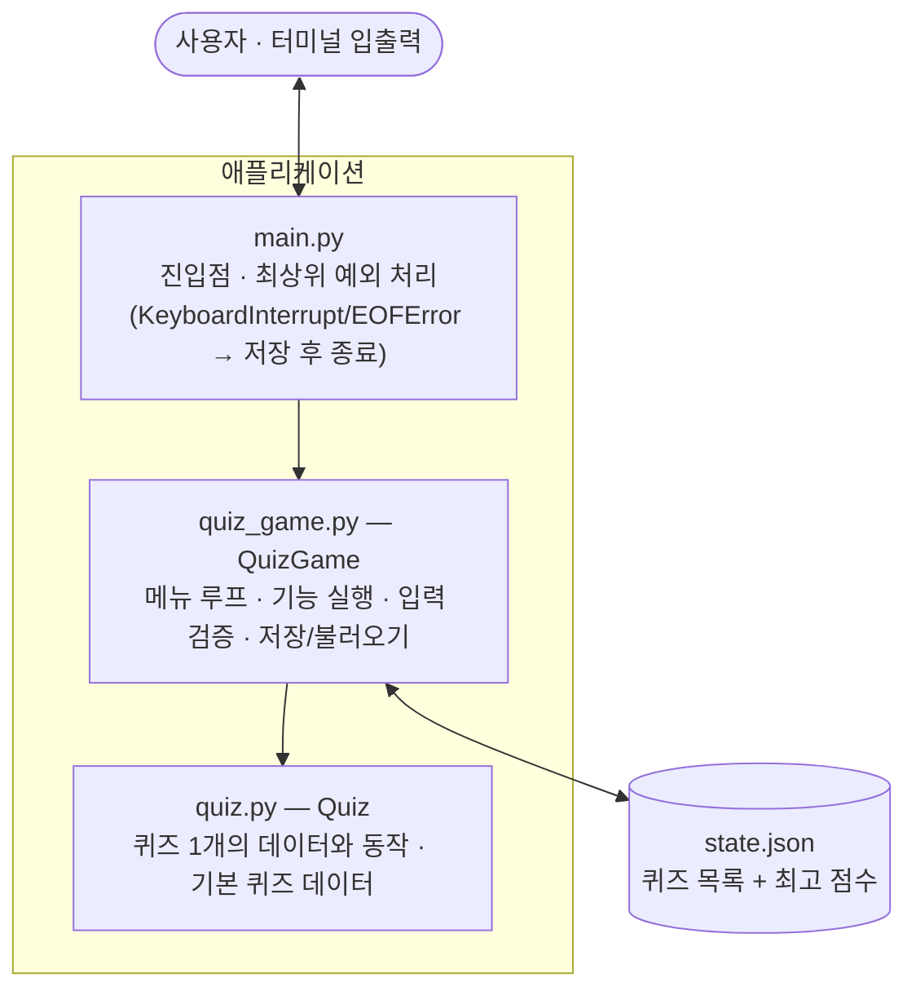
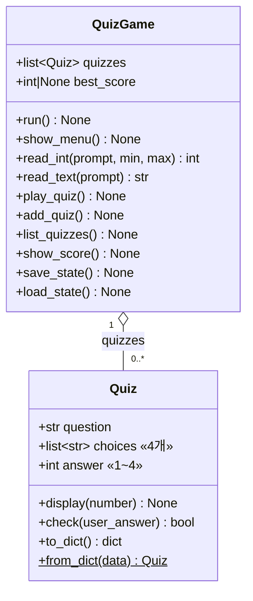
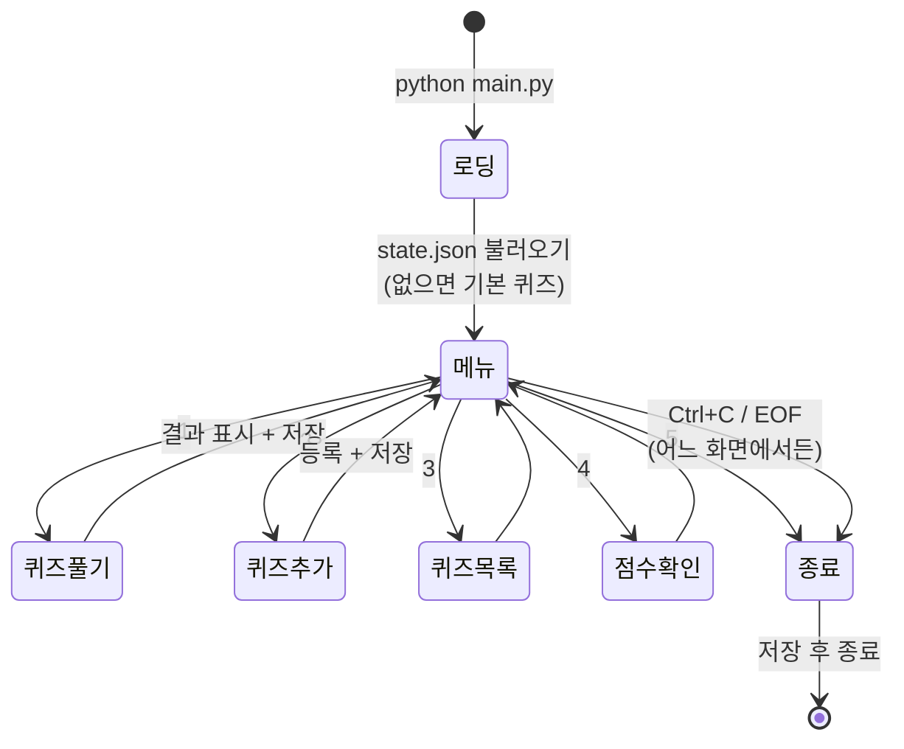
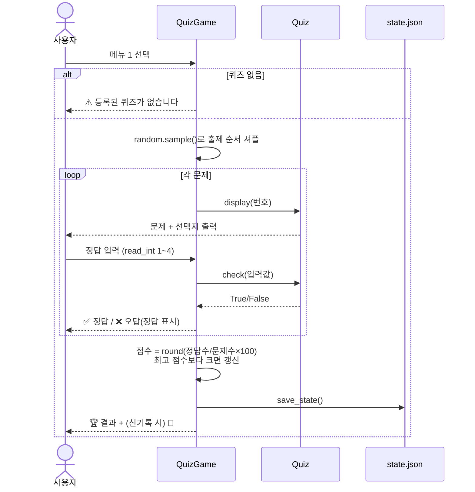
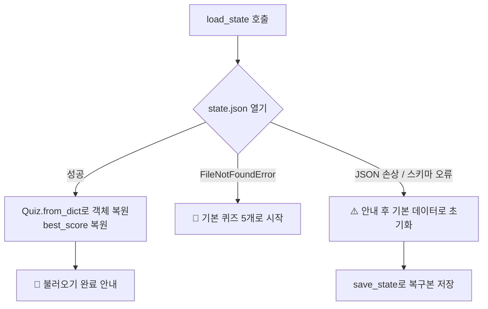

# 📄 시스템 사양서 — 나만의 퀴즈 게임

| 항목 | 내용 |
|---|---|
| 문서 버전 | 1.0 (2026-08-04) |
| 프로젝트 | Mission 2 — 터미널 퀴즈 게임 |
| 저장소 | https://github.com/newids/mission-2 |
| 관련 문서 | [mission_2.md](mission_2.md) (요구사항 원문) · [PLAN.md](PLAN.md) (수행 계획) · [CHECKLIST.md](CHECKLIST.md) (달성 검토) |

---

## 1. 개요

### 1.1 목적

터미널에서 동작하는 4지선다 퀴즈 게임을 Python으로 구현한다.
Python 기본 문법과 객체 지향(클래스), JSON 파일 저장을 통한 데이터 영속성, Git 기반 형상 관리를 실습하는 것이 목표다.

### 1.2 범위

- 콘솔(터미널) 환경의 단일 사용자 게임 — 네트워크/GUI/DB 없음
- 퀴즈 주제: **영화** (한국/해외 영화 상식)
- 데이터는 로컬 파일(`state.json`) 하나로 관리

### 1.3 실행 환경

| 구분 | 사양 |
|---|---|
| 언어 | Python 3.10 이상 |
| 의존성 | 표준 라이브러리만 사용 (`json`, `os`, `random`) — 외부 패키지 금지 |
| 실행 | 프로젝트 루트에서 `python main.py` |
| 인코딩 | 소스/데이터 모두 UTF-8 (터미널도 UTF-8 권장) |

---

## 2. 기능 요구사항

| ID | 기능 | 설명 | 구현 위치 |
|---|---|---|---|
| F1 | 메뉴 | 실행 시 메뉴 출력, 번호(1~5)로 기능 선택, 종료 제공 | `QuizGame.show_menu()` / `run()` |
| F2 | 퀴즈 풀기 | 등록된 퀴즈를 **랜덤 순서**로 전부 출제, 문제별 정답/오답 표시, 완료 시 점수(100점 만점) 표시 | `QuizGame.play_quiz()` |
| F3 | 퀴즈 추가 | 문제·선택지 4개·정답 번호(1~4)를 입력받아 등록, 즉시 파일 저장 | `QuizGame.add_quiz()` |
| F4 | 퀴즈 목록 | 등록된 퀴즈 전체를 번호와 함께 출력 | `QuizGame.list_quizzes()` |
| F5 | 점수 확인 | 최고 점수 표시 (기록 없으면 안내) | `QuizGame.show_score()` |
| F6 | 데이터 영속성 | 퀴즈 목록과 최고 점수를 `state.json`에 저장, 재실행 시 복원 | `save_state()` / `load_state()` |
| F7 | 기본 데이터 | 저장 파일이 없으면 영화 주제 기본 퀴즈 5개로 시작 | `quiz.default_quizzes()` |

### 비기능 요구사항

| ID | 항목 | 기준 |
|---|---|---|
| N1 | 입력 견고성 | 모든 숫자 입력에서 공백/빈 입력/비숫자/범위 밖 처리 후 재입력 |
| N2 | 안전 종료 | `Ctrl+C`·EOF 시에도 저장 후 정상 종료 (비정상 종료 금지) |
| N3 | 데이터 무결성 | 저장 실패가 기존 `state.json`을 손상시키지 않아야 함 (임시 파일 + 원자적 교체) |
| N4 | 복구 가능성 | 데이터 파일 손상 시 안내 후 기본 데이터로 자동 복구 |
| N5 | 코드 구조 | 클래스 2개 이상, 기능별 메서드 분리, 한 함수에 로직 집중 금지 |

---

## 3. 시스템 구성 (아키텍처 설계)

3개 모듈로 책임을 분리한 계층 구조다. 의존 방향은 아래로만 흐른다.



| 모듈 | 책임 | 알지 못하는 것(경계) |
|---|---|---|
| `main.py` | 게임 생성·실행, 중단 시그널을 안전 종료로 변환 | 게임 내부 로직 |
| `quiz_game.py` | 메뉴 흐름, 사용자 입력 검증, 채점, 파일 입출력 | 개별 퀴즈의 내부 표현(직렬화는 `Quiz`에 위임) |
| `quiz.py` | 퀴즈 1개의 출력·채점·직렬화(`to_dict`/`from_dict`) | 파일, 메뉴, 게임 진행 |

---

## 4. 클래스 설계



### 설계 원칙

- **입력 단일 창구**: 모든 사용자 입력은 `read_int()`(숫자) / `read_text()`(문자)를 통해서만 받는다. 검증(공백 제거, 빈 입력, 형 변환, 범위, 인코딩)이 한 곳에 모여 있어 새 기능도 같은 규칙을 자동으로 따른다.
- **직렬화 책임 분리**: JSON 구조 변환은 `Quiz.to_dict()`/`from_dict()`가 담당한다. `QuizGame`은 "무엇을 저장할지"만 알고 "어떻게 표현되는지"는 모른다.
- **정답 번호는 1-기반**: 속성·입력·파일 모두 1~4로 통일 (0-기반 변환은 출력 시점에만).

---

## 5. 화면(UI) 설계

### 5.1 화면 흐름



### 5.2 화면 명세

| 화면 | 레이아웃 규칙 |
|---|---|
| 메뉴 | `=` 40자 구분선 사이에 제목과 메뉴 5개. 이모지(🎯)로 제목 강조 |
| 퀴즈 풀기 | `[문제 n] 질문` + 들여쓴 선택지 4개, 문제 사이 `-` 40자 구분선, 결과는 `=` 구분선 박스 |
| 안내/경고 | 상태별 이모지 접두어 — ✅ 성공 · ❌ 오답 · ⚠️ 경고/오류 · 📂 데이터 · 📝📌📋 작업 · 🏆🎉 점수 |

메뉴 화면 (실제 출력):

```
========================================
          🎯 나만의 퀴즈 게임 🎯
========================================
        1. 퀴즈 풀기
        2. 퀴즈 추가
        3. 퀴즈 목록
        4. 점수 확인
        5. 종료
========================================
    선택:
```

퀴즈 풀기 → 결과 (실제 출력):

```
📝 퀴즈를 시작합니다! (총 5문제)
----------------------------------------
[문제 1] 영화 '인터스텔라'의 감독은?
    1. 크리스토퍼 놀란
    2. 스티븐 스필버그
    3. 제임스 캐머런
    4. 리들리 스콧
    정답 입력: 1
✅ 정답입니다!
----------------------------------------
========================================
🏆 결과: 5문제 중 4문제 정답! (80점)
🎉 새로운 최고 점수입니다!
========================================
```

---

## 6. 데이터 설계

### 6.1 저장 파일

| 항목 | 내용 |
|---|---|
| 경로 | 프로젝트 루트 `state.json` (상대 경로 — 루트에서 실행 전제) |
| 인코딩 | UTF-8, `ensure_ascii=False` (한글 원문 저장) |
| 저장 시점 | 퀴즈 추가 직후 · 퀴즈 풀기 완료 직후 · 종료 시 · 중단(Ctrl+C/EOF) 시 |
| 저장 방식 | `state.json.tmp`에 기록 → 성공 시 `os.replace()`로 원자적 교체 (N3) |

### 6.2 스키마

```json
{
  "quizzes": [
    {
      "question": "영화 '인터스텔라'의 감독은?",
      "choices": ["크리스토퍼 놀란", "스티븐 스필버그", "제임스 캐머런", "리들리 스콧"],
      "answer": 1
    }
  ],
  "best_score": 80
}
```

| 필드 | 타입 | 제약 | 설명 |
|---|---|---|---|
| `quizzes` | 배열 | — | 퀴즈 목록 |
| `quizzes[].question` | 문자열 | 비어 있지 않음 | 문제 |
| `quizzes[].choices` | 문자열 배열 | 4개 | 선택지 |
| `quizzes[].answer` | 정수 | 1~4 | 정답 번호 (1-기반) |
| `best_score` | 정수 \| null | 0~100 | 최고 점수. `null` = 기록 없음 |

---

## 7. 주요 처리 흐름

### 7.1 퀴즈 풀기 (F2)



### 7.2 시작 시 데이터 복원 (F6, F7)



---

## 8. 예외 처리 설계

| # | 상황 | 감지 | 처리 | 위치 |
|---|---|---|---|---|
| E1 | 빈 입력 / 비숫자 / 범위 밖 | 문자열 검사, `ValueError`, 범위 비교 | ⚠️ 안내 후 재입력 루프 | `read_int()` |
| E2 | 빈 텍스트 입력 | `strip()` 후 빈 문자열 | ⚠️ 안내 후 재입력 | `read_text()` |
| E3 | 인코딩 불일치 문자(surrogate) | `str.encode("utf-8")` 실패 | ⚠️ 터미널 인코딩 확인 안내 후 재입력 | `read_text()` |
| E4 | Ctrl+C / 입력 스트림 종료 | `KeyboardInterrupt` / `EOFError` | ⚠️ 안내 → 저장 → 정상 종료 | `main.py` |
| E5 | 데이터 파일 없음 | `FileNotFoundError` | 기본 퀴즈로 시작 | `load_state()` |
| E6 | 데이터 파일 손상 | `JSONDecodeError`, `KeyError` 등 | ⚠️ 안내 → 기본 데이터로 복구 저장 | `load_state()` |
| E7 | 저장 실패 (디스크/인코딩) | `OSError`, `ValueError` | ⚠️ 안내, 임시 파일 정리, 기존 파일 보존 | `save_state()` |

**원칙**: 사용자 실수(E1~E3)는 재입력으로, 환경 문제(E4~E7)는 "데이터를 지키면서" 안내 후 계속/종료로 처리한다. 어떤 경우에도 traceback을 노출하며 죽지 않는다.

---

## 9. 형상 관리 (Git 워크플로우)

| 규칙 | 내용 |
|---|---|
| 커밋 단위 | 기능 1개 = 커밋 1개 (메뉴/클래스/기능별/문서) |
| 메시지 형식 | `Feat:` `Fix:` `Refactor:` `Docs:` `Init:` `Merge:` + 한국어 요약 |
| 브랜치 | 기능 개발 시 `feature/*` 브랜치 생성 후 `main`에 병합 (예: `feature/play-quiz`) |
| 원격 | GitHub `newids/mission-2`, clone/pull 협업 흐름 실습 완료 |

---

## 10. 제약 및 향후 확장 (보너스 과제)

현재 미구현이며, 설계상 확장 지점은 다음과 같다.

| 확장 | 설계 반영 방법 |
|---|---|
| 문제 수 선택 | `play_quiz()` 시작 시 `read_int()`로 개수 입력 → `random.sample(quizzes, n)` |
| 힌트 기능 | `Quiz`에 `hint` 속성 추가 (스키마에 선택 필드, `from_dict`에서 `data.get("hint")`) |
| 퀴즈 삭제 | 메뉴 항목 추가 → 목록 표시 → 번호 선택 → `quizzes.pop()` → `save_state()` |
| 점수 히스토리 | 스키마에 `history` 배열 추가 (일시/문제 수/점수) — `best_score`와 병행 유지 |
